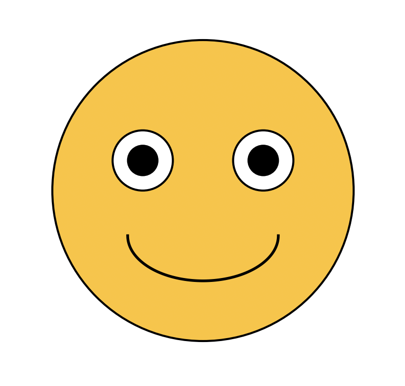

+++
title = 'Calling Python with Keywords Arguments'
date = 2024-04-07T15:05:52+05:45
author = 'dorjeduck'
draft = false

categories = ["stdlib"]
tags = ["mojo 24.2.0","python"]
+++


---

### Context

- **Mojo Reference**: [Python](https://docs.modular.com/mojo/stdlib/python/)
- **Mojo Manual**: [Python Integration](https://docs.modular.com/mojo/manual/python/)
- **Mojo Blog**: [What’s new in Mojo 24.2](https://www.modular.com/blog/whats-new-in-mojo-24-2-mojo-nightly-enhanced-python-interop-oss-stdlib-and-more)
- **Mojo Version**: 24.2.0

---

### Demo: Paint a Smiley

---
  
```python
from python import Python

fn main() raises:
    var np = Python.import_module("numpy")
    var plt = Python.import_module("matplotlib.pyplot")
 
    var fig = plt.figure(figsize=(6,6))
    var ax = fig.add_subplot(1, 1, 1)

    ax.set_xlim(-1.5, 1.5)
    ax.set_ylim(-1.5, 1.5)

    ax.set_aspect('equal')
    ax.axis('off')

    # Face
    var face = plt.Circle((0, 0), 1, color='#FFC324', ec="black", lw=1.5)
    ax.add_artist(face)

    # Eyes
    var left_eye = plt.Circle((-0.4, 0.2), 0.2, color='white', ec="black", lw=1.5)
    var right_eye = plt.Circle((0.4, 0.2), 0.2, color='white', ec="black", lw=1.5)

    ax.add_artist(left_eye)
    ax.add_artist(right_eye)

    # Pupils
    var left_pupil = plt.Circle((-0.4, 0.2), 0.1, color='black')    
    var right_pupil = plt.Circle((0.4, 0.2), 0.1, color='black')
    
    ax.add_artist(left_pupil)
    ax.add_artist(right_pupil)

    # Mouth
    var angles = np.linspace(np.pi, 2*np.pi, 100)
    var x_mouth = np.cos(angles) * 0.5
    var y_mouth = np.sin(angles) * 0.3 - 0.3
    
    ax.plot(x_mouth, y_mouth, color="black", linewidth=2)

    plt.show()
```

---

Output:



---

### Remarks

You need to have `numpy` and `matpotlib` installed to run this demo.

- NumPy: [Installation Guide](https://numpy.org/install/)
- Matplotlib: [Installation Guide](https://matplotlib.org/stable/users/installing.html)
